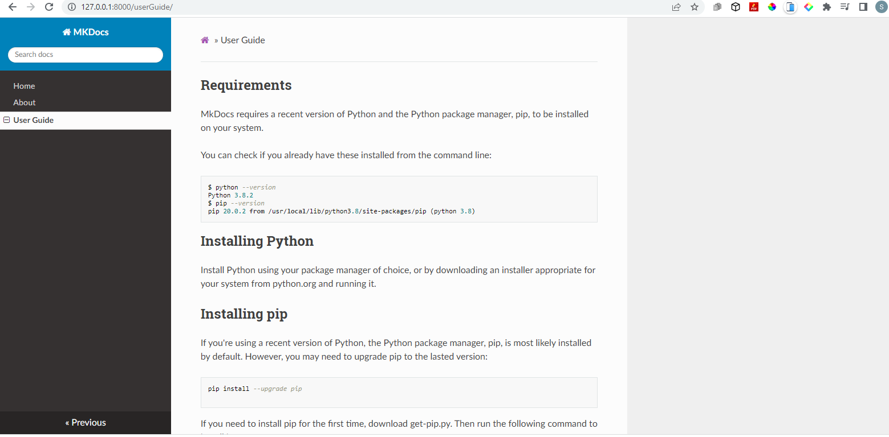

## **A Detailed guide to MKDocs**


### **Table of Contents**
- Introduction
- What is MKDocs?
- Why use MKDocs
- Requirements for installation of MKDocs
- Installation of MKDocs
- Writing your documentations with MKDocs
- Theming your documentation
-  How to deploy your docs
- Conclusion

### **Introduction**
We live in a **Degital Age**, an era where there is accelerated technological progress. Many businesses are now using technology to advance their businesses. How can business owners, developers, and teams provide detailed user-guides, project documentation or API references in a
 well organized manner? This is where MKDocs comes in. MKDocs is a static site generator for creating documentation. 

This article  will explain what MKDocs is and how it works, the features of MKDocs and step by step guide on how to us it.

### **What is MKDocs?**
MKDocs is a static site generator that is used for creating documentation from Markdown files. MKDocs allows you to build simple, fast, well organized and responsive documentation.
Documentation sites are written with Markdown and configured with a single file called **YAML**.

### **Why use MKDocs?**

- **Customizable and responsive themes**

MCKDocs offers varities of good looking themes
 that are responsive. You can choose between built in themes,select a third-party theme or build your own theme.

- **Preview your site as you work** 

MCKDocs allows you to preview you documentation as you work. It auto reloads and refresh your browser anytime you save any change made to your work.

- **Host Anywhere**

You can host your work on GitHub Pages, Amazon S3, or any other place of your choice.

- **Simple Configuration**

MKDocs uses simple configuration file called **mkdocs.yml** to control settings. This configuration file allows you to customize your documentation to your preference and needs.

- **Navigation and Search Features**

MKDocs automatically generates table of contents and navigation side bar based on your preference, making it easier for users to find information quickly and efficently.

### **Requirements for installation of MKDocs**

To build a documentation with MKDocs, you need to have the recent version of **Python** and Python package manager called **Pip**.

To check if you have **Python** and pip installed in your system: 

- Right click on your your Computer Desktop and click on "Git Bash Here".
  
  
  
- Copy and paste the following command in your command line. 

```
 python --version
 ```
 Your command line will indicate the version of Python in your system as shown in the image below:

 

 Once, you have confirmed that you have Python installed in your system, check for the pip version too. Copy the command below and paste on your command line. 

 ```
pip --version
 ```


However, if you do not have **Python** installed in system, you will need to install it in your device. To do this:
  
  - Click on https://www.python.org/ .
The link will take you to Python website. 


- At the top, Hover over **Downloads**, a drop-down menu with pop-up.


- Under **Download for Windows**, click on the button showing the latest version of Python. 


- If you are using macOS, click on "**macOS**" to download the latest version of Python on macOS.


 

 

 - To install your file, click on the downloaded file.Before installing, check the box to **Add Python.exe to Path**  


  
  - Click on **Install now**. After installation, a box will pop up showing that the installation was successful.


### **Installation of Pip**
Pip (Python package manager) is most likely in your system if you have the latest version of Python installed in your system. However you will need ugrade it using the command below.

```
pip install --upgrade pip
```

If you do not have Pip installed in your system, run the following command to install it:

```
python get-pip.py
```

### **Installation of MKDocs**

 MKDocs works with the current version of **Python** and **Pip** in your system. If you do not have **Python** installed in your system, follow the guides outlined above on how to install Python and Pip on your system. If you have the current version of Python on you system, then let us move on to the installation process. 


To install MKDocs, run the command below in your command line.

```
pip install mkdocs
```
After installation, your command line will indicated that you have successfully installed MKDocs.


### **Writing your documentations with MKDocs**

Documentation are  written using a text formater known as **Markdown**. Markdown is also used for stucturing plain text. It is a light weight markup language used in MKDocs for creating documentation. To learn more about markdown and how to work with it, click on https://www.markdownguide.org/basic-syntax/. 

Let's move ahead with creating a project folder.To create your project folder:

- On your terminal, run the command below:

```
mkdocs new my-project
```


- Move into the folder ("my-project") you created using the command below:

```
cd my-project
```


- Move to Visual Studios Code from your terminal by running the command below from your command line:

```
code .
```


From the folder, you will see a single configuration file named **mkdocs.yml** and a  folder named **docs** that contains **index.md**.  "docs" will hold all your documentation source file while "mkdocs.yml" will serve as the central configuration file where you customize various aspect of your site to suite your specific needs and preferences.

Let us view our project on the browser before customizing our documentation to our preference. To do this, go back to your terminal and run the command below:

```
mkdocs serve
```

Running the command above, will build your documentaion and then, provide a your site link. Copy the link and paste it on your browser.


Your project should look like the image below:


MKDocs dev-server supports auto-reloading. This means that it rebuilds as soon as you make changes to your configuration file, theme or documentation directory.  

Having succesfully created a project folder and ran it on the browser, let us make changes to the documentaion and customize it to our preference using MKDocs as a case study.


**Change Site Name and Add Site URL**

<!-- Let us make changes to the **Home Page**. We will do the following:
- Change the site name
- Add site url. -->


 On you Visual Studio Code(VS Code) or any code editor of your choice, do the following:


- Click on the **mkdocs.yml**. This will open the configuration file where you will configure your documentation to your preference.


- Copy and paste the changes below:
  ```
  site_name: MKDocs

  site_url:  https://example.com/
  ```

After making changes to your site name, save the changes and check your browser. You will notice that your site name changed immediately. 


The **site_name** and the **site_url** are the only two required options in your configuration file.


**Adding pages**

Let us add the following pages:
- Home Page
- About Page
- User Guide

1. First, go to your VS Code and create the above 
files under the "docs" folder.


2. Next, we will edit the **mkdocs.yml** by adding a nav setting to it. Copy the settings below

```
nav:
- Home: index.md
- About: about.md
- User Guide: userGuide.md

```

From the settings above, notice that the **Home Page** is linked to the index.md file.

Next, let us add more information to the **About Page** and the **User Guide page**. 

 Click on the **about.md** and **userguide.md** and write your documentation as shown in the images below:
 


Go to your browser and see the changes you have made.


From the navigation bar, you will see the Home Page, About and User Guide on the left as well the Search, Previous and Next on the right.
 
 The search button allows users to easily make searches.
 

You can add more pages to your documentation and write to suit your need. 

### **Theming your documentation**

You can alter how your documentation is displayed by changing your theme.You can do this by editing the **mkdoc.yml** file. Add theme setting to it. In our project, we will use **readthedocs** theme setting. Copy and paste the setting below in your "mkdocs.yml" file.

```
theme: readthedocs
```

Save the changes and check your browser. You will notice that the style of your documentation has changed as shown below:

