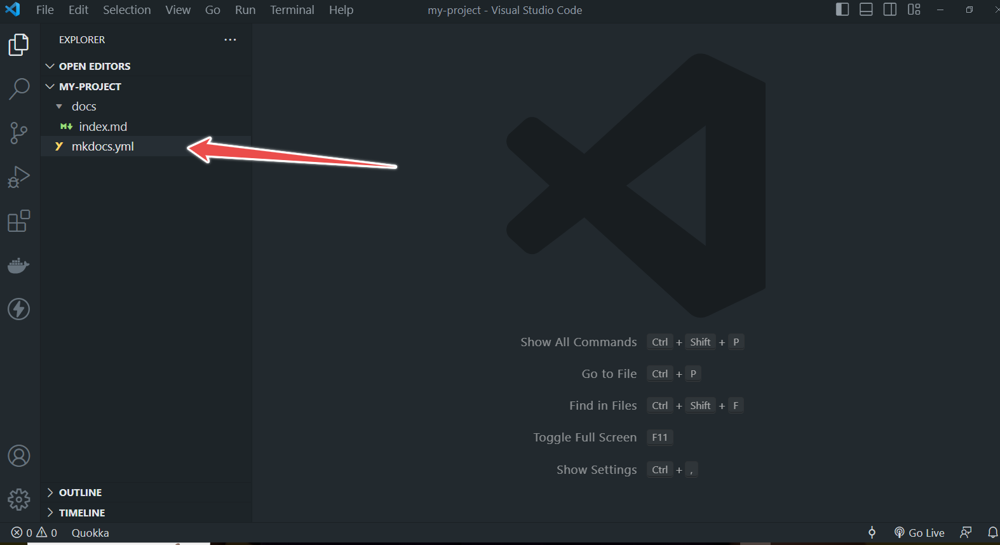
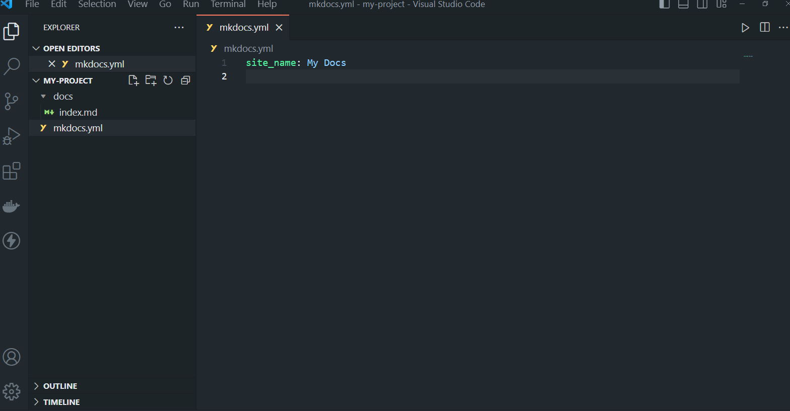
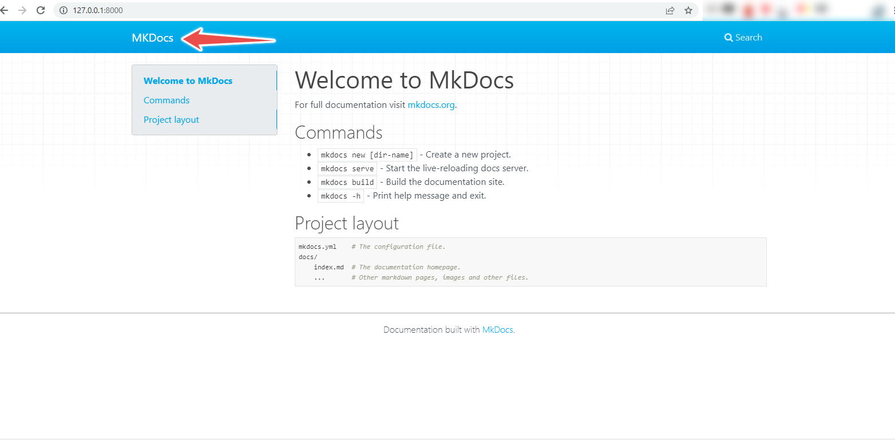
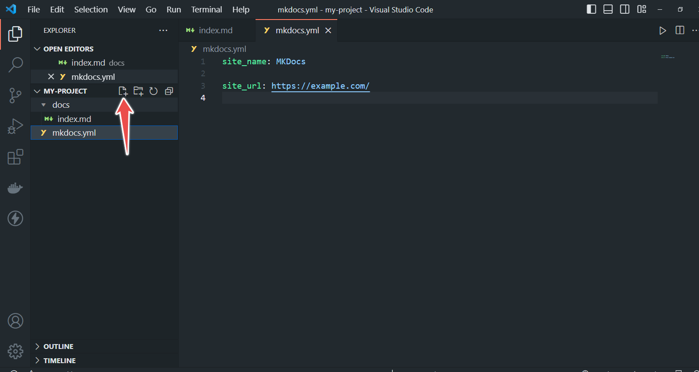
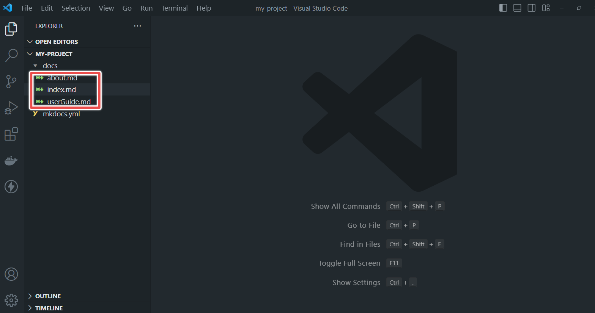
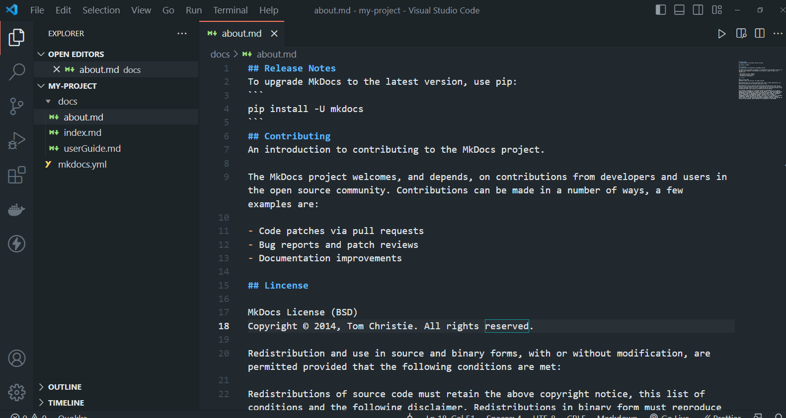
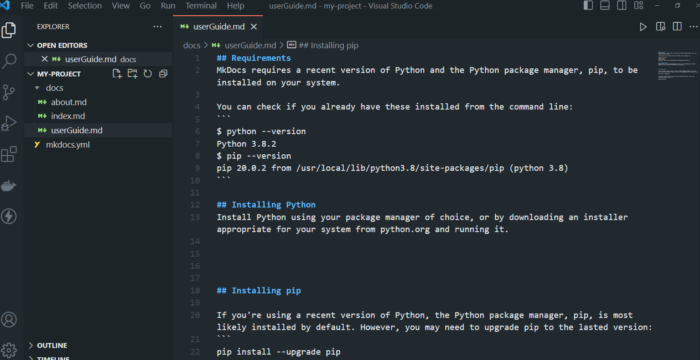
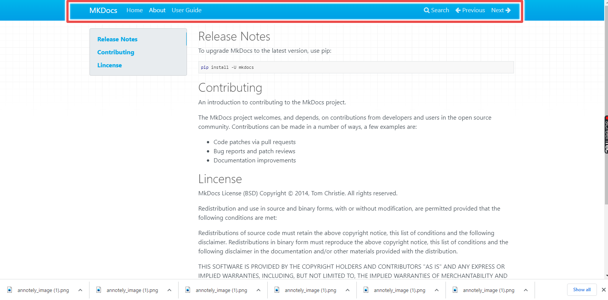
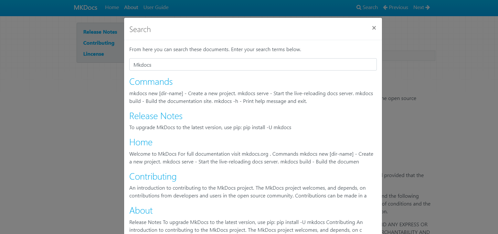

## **How to build documentation with MKDocs**


### **Table of Contents**
- Introduction
- What is MKDocs?
- What are the benefits of using MKDocs?
- What are the requirements for installing MKDocs?
- How to install MKDocs
- Writing your documentations with MKDocs
- Theming your documentation
<!-- -  Deploying your Documentation -->
- Conclusion

### **Introduction**
We live in a **Degital Age**, an era where there is accelerated technological progress. Many businesses are now using technology to advance their businesses.Developers as well are constanly building products with the latest technology. How can business owners, developers, and teams provide detailed user-guides, project documentation or API references in a
 well organized manner? This is where MKDocs comes in. MKDocs is a static site generator for creating documentation. It can be used to create product user guides, API documentation, operational manuals and so on.

This article  will explain what MKDocs is and how it works, the features of MKDocs and step by step guide on how to build documentation with it.

### **What is MKDocs?**
MKDocs is a static site generator that is used for creating documentation from Markdown files. MKDocs allows you to build simple, fast, well organized and responsive documentation.
MKDocs documentation sites are written with Python Markdown and configured with a single file called **YAML**.

### **What are the benefits of using MKDocs?**

- **Customizable and responsive themes**

MCKDocs offers varities of good looking themes
 that are responsive. You can choose between built in themes,select a third-party theme or build your own theme.

- **Preview your site as you work** 

MCKDocs allows you to preview you documentation as you work. It auto reloads and refresh the browser anytime you save changes made to your work.

- **Host Anywhere**

You can host your work on GitHub Pages, Amazon S3, or any other place of your choice.

- **Simple Configuration**

MKDocs uses simple configuration file called **mkdocs.yml** to control settings. This configuration file allows you to customize your documentation to your preference and needs.

- **Navigation and Search Features**

MKDocs automatically generates table of contents and navigation side bar based on your preference, making it easier for users to find information quickly and efficently.

### **What are the requirements for installing MKDocs?**

To install MKDocs, you need to have the recent version of **Python** and Python package manager called **Pip** installed in your computer.

To check if you have **Python** and pip installed in your system: 

- Right click on your your Computer Desktop and click on "Git Bash Here".
  
  
  
- Copy and paste the following command in your command line. 

```
 python --version
 ```
 Your command line will indicate the version of Python in your system as shown in the image below:

 

 Once, you have confirmed that you have Python installed in your system, check for the pip version too. Copy the command below and paste on your command line. 

 ```
pip --version
 ```


However, if you do not have **Python** installed in system, you will need to install it in your device. Follow the procedure below to install Python and Pip in your device.
  
  - Click on https://www.python.org/ .
This link will take you to Python website. 


- At the top, Hover over **Downloads**, a drop-down menu will pop-up.


- Under **Download for Windows**, click on the button showing the latest version of Python. 


- If you are using macOS, click on "**macOS**" to download the latest version of Python on macOS.


 

 

 - To install your file, click on the downloaded file.Before installing, check the box to **Add Python.exe to Path**  


  
  - Click on **Install now**. After installation, a box will pop up showing that the installation was successful.


### **Installation of Pip**
Pip (Python package manager) is most likely in your system if you have the latest version of Python installed in your system. However you will need ugrade it using the command below.

```
pip install --upgrade pip
```

If you do not have Pip installed in your system, run the following command to install it:

```
python get-pip.py
```

### **How to install MKDocs**

 MKDocs works with the current version of **Python** and **Pip** in your system. If you do not have **Python** installed in your system, follow the installation guides outlined above. If you have the current version of Python on you system, then let us move on to the installation process. 


To install MKDocs, run the command below in your command line.

```
pip install mkdocs
```
After installation, your command line will indicated that you have successfully installed MKDocs.


### **Writing your documentations with MKDocs**

Documentation are  written using a text formater known as **Markdown**. Markdown is also used for stucturing plain text. It is a light weight markup language used in MKDocs for creating documentation. To learn more about markdown and how to work with it, click on https://www.markdownguide.org/basic-syntax/. Mark down files are placed inside the documentation directory. This directory is known as **docs** and will be positioned at the top level of your project together with **macdocs,yml** configuration file.

Let's move ahead with creating a project folder.To create your project folder for creating a sample documentation.

- On your terminal, run the command below:

```
mkdocs new my-project
```


- Move into the folder ("my-project") you created using the command below:

```
cd my-project
```


- Move to Visual Studios Code from your terminal by running the command below from your command line:

```
code .
```


From the folder, you will see a single configuration file named **mkdocs.yml** and another folder named **docs** that contains **index.md**.  "docs" will hold all your documentation source file while "mkdocs.yml" will serve as the central configuration file where you customize various aspect of your site to suite your specific needs and preferences.

Let us view our project on the browser before customizing our documentation to our preference. To do this, go back to your terminal and run the command below:

```
mkdocs serve
```

Running the command above, will build your documentaion and then, provide a your site link. Copy the link and paste it on your browser.


Your project should look like the image below:


MKDocs dev-server supports auto-reloading. This means that it rebuilds as soon as you make changes to your configuration file, theme or documentation directory.  

Having succesfully created a project folder and ran it on the browser, let us make changes to the documentaion and customize it to our preference using MKDocs as a case study.


**Change Site Name and Add Site URL**


 On you Visual Studio Code(VS Code) or any code editor of your choice, do the following:


- Click on the **mkdocs.yml**. This will open the configuration file where you will configure your documentation to your preference.





- Copy and paste the changes below:
  ```
  site_name: MKDocs

  site_url:  https://example.com/
  ```

After making changes to your site name, save the changes and check your browser. You will notice that your site name changed immediately. 



The **site_name** and the **site_url** are the only two required options in your configuration file.


**Adding pages**

Let us add the following pages:
- Home Page
- About Page
- User Guide

1. First, go to your VS Code and create the above 
files under the "docs" folder.






2. Next, we will edit the **mkdocs.yml** by adding a nav setting to it. Copy the settings below

```
nav:
- Home: index.md
- About: about.md
- User Guide: userGuide.md

```

Your project Home Page should be names **index.md** by convention.

Next, let us add more information to the **About Page** and the **User Guide page**. 

 Click on the **about.md** and **userguide.md** and write your documentation as shown in the images below:
 




Go to your browser and see the changes you have made.



From the navigation bar, you will see the Home Page, About and User Guide on the left as well the Search, Previous and Next on the right.
 
 The search button allows users to search any text one any page.
 

You can add more pages to your documentation and write to suit your need. 

Furthermore, you can nest pages under a section title by listing related pages together.
To do this:
- On your VS code, create the files you want to next.


Note: All files should be created inside the **docs** folder.

- Next, group related pages under a section title as shown below:
  

  The above configuration contains five top level items : "Home", "Getting Started", " User Guide", " Developer Guide" and the " About". "Home" is the link to the homepage, "Getting Started" is the link to the getting started page. The "User Guide" has pages nested under it which are:'installation.md', "writing-your-docs.md", "choosing-your-theme.md", "customizing-your-theme.md", "localizing-your-theme.md" and so on. The same format of nesting applies to "Developer Guide" and the "About".


  It should look like the image below on your browser:

  

  When you click on the drop down arrow beside any section title, a drop down-menu containing the grouped pages will appear.

  

### **Theming your documentation**
MKDocs has two built in theme which are:
1. macdocs theme
2. readthedocs

**macdocs** is the default theme and was built with a custom Bootstrap theme. It supports most features of Macdocs.
**readthedocs** theme is a clone of the default theme used by the Read The Docs services.
It offers the same restricted feature-set as the macdocs and supports only two levels of navigation.

However, there are other third party themes you can choose from as well.

To choose theme, go to **mkdoc.yml** config file and set the theme using the command shown below:


```
theme: readthedocs
```

Save the changes and check your browser. You will notice that the theme of your documentation.


**Conclusion**

MkDocs is a static site generator that allows you to create stunning and organized documentaion using Markdown files. It's simplicity and flexibility makes it an excellent choice for developers, technical writers, content creators and businesses alike. With **Git** interation, you can save and manage you documentation in a repository. Additionally, MKDocs offers wide range of customizable themes, allowing your to tailor your documentation to your prefence and requirement. Whether you need user guides or comprehensive documentation, MkDocs empowers you to build beautiful and curated resources for your audience.


<!-- MkDocs is a powerful static site generator that allows you to create stunning and organized documentation using Markdown files. Its simplicity and flexibility make it an excellent choice for developers, content creators, and businesses alike. With Git integration, you can easily save and manage your documentation in a repository, leveraging version control features. Additionally, MkDocs offers a wide range of customizable themes, allowing you to tailor the look and feel of your documentation to your preference and requirements. Whether you need user guides or comprehensive documentation, MkDocs empowers you to build beautiful and curated resources for your audience. -->