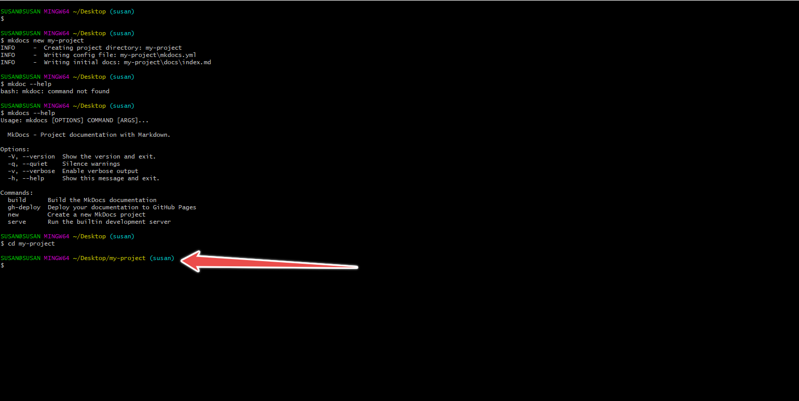

## **A Detailed guide to MKDocs**

### **Table of Contents**
- Introductions
- What is MKDocs?
- Features of MKDocs
- Requirements for installation of MKDocs
- Installation of MKDocs
- Writing your documentations with MKDocs
- How to choose your theme 
-  How to localize your theme
-  How to configure your documentation
-  How to deploy your docs
- Conclusion


### **Requirements for installation of MKDocs**

To build a documentation with MKDocs, you need to have the recent version of **Python** and Python package manager called **Pip**.

To check if you have **Python** and pip installed in your system: 

- Right click on your your Computer Desktop and click on "Git Bash Here".
  
  
  
- Copy and paste the following command in your command line. You can also run the command in your Visual Studio Code terminal.

```
 python --version
 ```
 Your command line or terminal will indicate the version of Python in your system as indicated in the image below:

 

 Once, you have confirmed that you have Python installed in your system,copy the next command and paste on your command line or terminal.

 ```
pip --version
 ```


However, if you do not have **Python** installed in system. 
  
  - Click on https://www.python.org/ .
The link will take you to the website where you will download and installed Python.


- At the top, Hover over "**Downloads**", a drop-down menu with pop-up.


- Under "**Download for Windows**", click on the button showing the latest version of Python. 


- If you are using macOS, click on "**macOS**" to download the latest version of Python on macOS.


 

 

 - After downloading, click on the downloaded file.Before installing, check the box to "**Add Python.exe to Path**"  


  
  - Click on "**Install now**". After installation, a box will pop up showing that the installation was successful.


### **Installation of Pip**
If you have the latest version of Python installed in your system, then, Pip (Python package manager) is mostly likely in you system but you will need ugrade it using the command line the command line below

```
pip install --upgrade pip
```

If you do not have pip installed in your system, run the following command to install it:

```
python get-pip.py
```

### **Installation of MKDocs**

To install MKDocs, you are required to have the current version of **Python** and **Pip** in your system. If you do not have **Python** installed in your system, follow the guides outlined above on how to install Python and Pip on your system. However, if you have the current version of Python on you system:


- Run the command below in your command line or your Visual Studio Code.

```
pip install mkdocs
```
After installation, your command line will indicated that you have successfully installed MKDocs.


### **Writing your documentations with MKDocs**

Your documentation should be written using **Markdown**. Markdown is used for formatting and stucturing plain text. It is a light weight markup language used in MKDocs for creating documentation. To learn more about markdown and how to work with it, click on https://www.markdownguide.org/basic-syntax/.

To create your project folder:

- On your terminal, run the command below:

```
mkdocs new my-project
```


- Move into the folder (my-project) you created using the command below:

```
cd my-project
```



- Move to Visual Studios Code from your terminal by running the command below:

```
code .
```


From the folder, you will see a single configuration file named **mkdocs.yml** and a  folder named **docs** that contains **index.md**. " "docs" will hold all your documentation source file while "mkdocs.yml" will serve as the central configuration file where you customize various aspect of your site to suite your specific needs and preferences.

Let us view our project on the browser before making customizing our documentation. To do this, go back to your terminal and run the command below

```
mkdocs serve
```

Running the command above, will build your documentaion and then, provide a link. Copy the link and paste it on your browser.


Your project should look like the image below:

